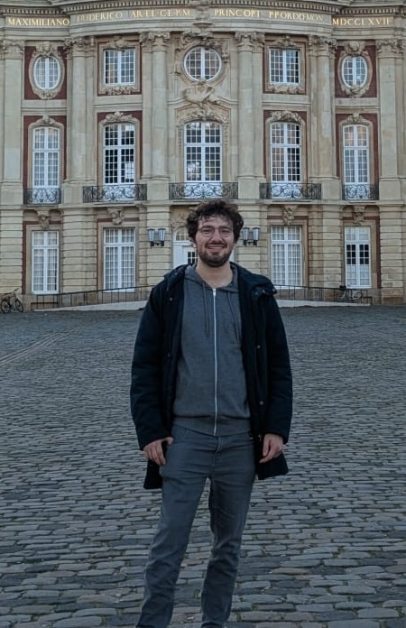

---
---

::: {.columns}

::: {.column width="75%"}

Welcome to my site!

I’m Francesco, a PhD student at Gran Sasso Science Institute in L’Aquila.

I'm working on black hole stability, specifically on asymptotically AdS Lorentzian manifolds.

More broadly, my current and past research interests include PDEs on curved spacetimes, Riemannian geometry, and optimal transport.

:::

::: {.column width="25%"}

  

:::
:::